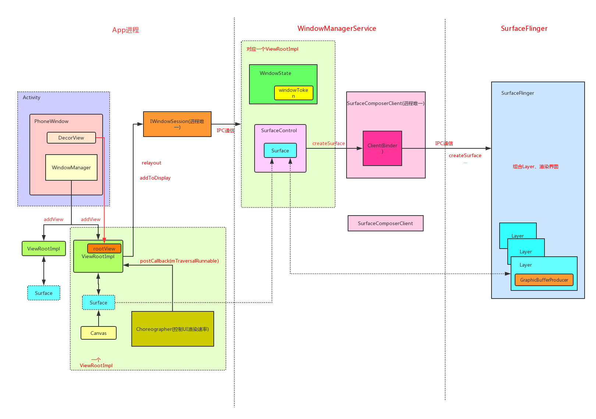

>本文是[Android视图层源码分析](https://github.com/SusionSuc/AdvancedAndroid/blob/master/AndroidFramework%E6%BA%90%E7%A0%81%E5%88%86%E6%9E%90/Android%E8%A7%86%E5%9B%BE%E5%B1%82%E6%BA%90%E7%A0%81%E5%88%86%E6%9E%90/README.md)系列第4篇文章，主要是对前几篇文章做一个总结，理解Android视图的主要组成部分和相互之间的工作逻辑。本文内容是基于[Google Android Repo](https://android.googlesource.com/)中的较新的源码分析而得来的。

这张图大致解释了各模块之间的关系:



下文内容并没有具体的分析逻辑，主要是解释上图中各模块的职责，算是对Android视图层各模块的一个小总结，方便对于整个Android整个UI显示原理的理解。

# Window相关

`Window`可以说是`Android Framework`层提供的一个最基础的`UI`组件管理类，`PhoneWindow`是它的唯一实现类。它屏蔽了开发者与`WindowManagerService`的交互，统一了UI设计，并统一接收用户交互事件，比如背景、title和按键事件等。

`Activity/Dialog/Toast`的UI展现都是依赖于`Window`来完成。对于UI编写，开发者只需要使用`View`相关即可。`View`最终会以`ContentView`的形式设置给`Window`:

>PhoneWindow.java
```
  public void setContentView(int layoutResID) {
  }
```

`DecorView`是`PhoneWindow`的`根ViewGroup`。`Window`提供了一些列的配置项，不同的配置项`DecorView`的UI组成会有一定的不同。关于`Window`的具体组成可以参考前面(深入剖析Window组成)[深入剖析Window组成.md]一文。

## WindowManager

一个`Window`会有一个`WindowManager`。提到`WindowManager`就要提到`WindowManagerGlobal`。他们之间的区别是:

- WindowManager : 它负责管理一个`Window`，并提供一系列对`Window`进行配置的flag。
- WindowManagerGlobal : 它是一个单例类，负责管理应用所有的`Window`(其实并不是很严谨，应该是管理所有的`ViewRootImpl`)。并且它含有与`WindowManagerService`通信的`Binder`。

`WindowManager`所提供的API其实都是用来操作`WindowManagerGlobal`中的`ViewRootImpl`。比如`WindowManager.addView(contentView)`实际上是在`WindowManagerGlobal`中创建了一个与`contentView`对应的`ViewRootImpl`。

## ViewRootImpl

它负责管理一个具体的`View Tree`，比如`DecorView`及其所有子View。具体有下面这些职责:

- 通过与`WindowManagerService`通信，创建`Surface`来显示其管理的`View Tree`
- 管理整个`View Tree`的测量、布局、绘制。具体方法是`performTraversals`
- 通过`Choreographer`来使整个`ViewTree`的UI刷新(测量、布局、绘制)与系统同步。

## Choreographer

`Choreographer`用来控制同步处理输入(Input)、动画(Animation)、绘制(Draw)三个UI操作(UI显示的时候每一帧要完成的事情只有这三种)。其内部维护着一个`Queue`,使用者可以通过`postXXX`来把一些列待运行的UI操作放到`Queue`中。这些事件会在`Choreographer`接收显示系统的时间脉冲(垂直同步信号-VSync信号)后执行这些操作。比如`ViewRootImpl`对于`View Tree`的更新事件:

>ViewRootImpl.java
```
void scheduleTraversals() {
    ...
     mChoreographer.postCallback(Choreographer.CALLBACK_TRAVERSAL, mTraversalRunnable, null);
}
```

## Surface

一个`ViewRootImpl`含有一个`Surface`(一个`Surface`含有一个`Canvas`)。可以把它理解为一个画布,通过`Canvas`可以在上面作画。`ViewRootImpl`的整个`ViewTree`是`draw`在`Surface`上的。

它实际上对应的是`SurfaceFlinger`中的`Layer`，在`Surface`上绘制的内容最终会由`SurfaceFlinger`来渲染。

## WindowManagerService

它管理着所有应用程序的`Window`:

- 管理所有`Window`的状态(WindowState)
- 与`SurfaceFlinger`通信，完成`Window`的渲染

通过`ViewRootImpl`可以向`WindowManagerService`添加一个`Window`:

>ViewRootImpl.java
```
public void setView(View view, WindowManager.LayoutParams attrs, View panelParentView) {
    ...
    //mWindow是一个`Binder`
    res = mWindowSession.addToDisplay(mWindow, mSeq, mWindowAttributes,
                        getHostVisibility(), mDisplay.getDisplayId(), mWinFrame,
                        mAttachInfo.mContentInsets, mAttachInfo.mStableInsets,
                        mAttachInfo.mOutsets, mAttachInfo.mDisplayCutout, mInputChannel);
    ...
}
```

`mWindowSession`是`IWindowSession`的实例，是一个与`WindowManagerService`通信的`Binder`。由`WindowManagerGlobal`创建和维护，一个应用程序只会有一个。

### WindowToken和WindowState

`WindowState`用于在`WindowManagerService`中代表一个`Window`，它含有一个窗口的所有属性，它和`ViewRootImpl`是对应的。它被保存在`WindowManagerService`的`mWindowMap`集合中。`mWindowMap`是整个系统所有窗口的一个全集。

`WindowToken`将属于同一个应用程序组件的窗口组织在一起。在`WindowManagerService`对窗口管理的过程中，用`WindowToken`代表一个应用组件。例如在进行窗口Z-Order排序时,属于同一个`WindowToken`的窗口(`Window`)会被安排在一起,也可以理解为渲染`Window的Surface`的Z轴顺序。一个token下可以有多个`WindowState(Window)`:

>WindowManagerService.addWindow()
```
win.mToken.addWindow(win);//一个token下会有多个win state
```

# SurfaceFlinger相关

`SurfaceFlinger`是Android最重要的系统服务之一，它主要负责`UI`的渲染，具体可以说是`Layer`的合成和渲染。下面介绍的几个对象基本都是存在于`WindowManagerService`中的。是应用程序与`SurfaceFlinger`交互的关键对象。

## SurfaceControl

可以简单的把它理解为`Surface`的管理者。它和`Surface`是一对一的关系。构建`SurfaceControl`的同时就会构造`Surface`。`ViewRootImpl`的`Surface`实际上和它指向的是同一个对象。它可以通过`SurfaceComposerClient`来与`SurfaceFlinger`通信。比如请求`SurfaceFlinger`创建`Surface(Layer)`

## SurfaceComposerClient

这个对象也是进程唯一的，一个应用只有一个。可以通过它与`SurfaceFlinger`建立连接，从而与`SurfaceFlinger`通信。具体通信的功能是由`Client`对象来完成的。

## Client

它是一个`Binder`,`SurfaceComposerClient`可以通过它来与`SurfaceFlinger`通信。比如通过它可以使`SurfaceFlinger`创建一个`Layer`。它也维护着一个应用程序所有的`Layer`。

## Layer

被`SurfaceFlinger`管理着，分为多种不同的类型。它是一个可被`SurfaceFlinger`渲染的单元。它有一个`BufferQueueProducer`,里面维护着很多可以被渲染的`GraphicBuffer`,这个buffer可能被渲染完毕，也可能处于待渲染状态。


想详细了解上面知识，阅读源码是权威的办法，也可以参考下面这些文章来理清思路:

[Android视图层源码分析](README.md)

[理清Activity、View及Window之间关系](https://blog.csdn.net/huachao1001/article/details/51866287)

[Android Choreographer 源码分析](https://www.jianshu.com/p/996bca12eb1d)

[一篇文章看明白 Android 图形系统 Surface 与 SurfaceFlinger 之间的关系](https://blog.csdn.net/freekiteyu/article/details/79483406)

[老罗的Android之旅](https://www.kancloud.cn/alex_wsc/androids/473757)

[Android显示原理源码分析](https://blog.csdn.net/Awenyini/article/details/79450770)

[AndroidUI系列—浅谈图像渲染机制](https://www.jianshu.com/p/1998182670fb)

[深入理解Android]系列从书


最后:

**欢迎关注我的[Android进阶计划](https://github.com/SusionSuc/AdvancedAndroid)看更多干货**

**欢迎关注我的微信公众号:susion随心**


