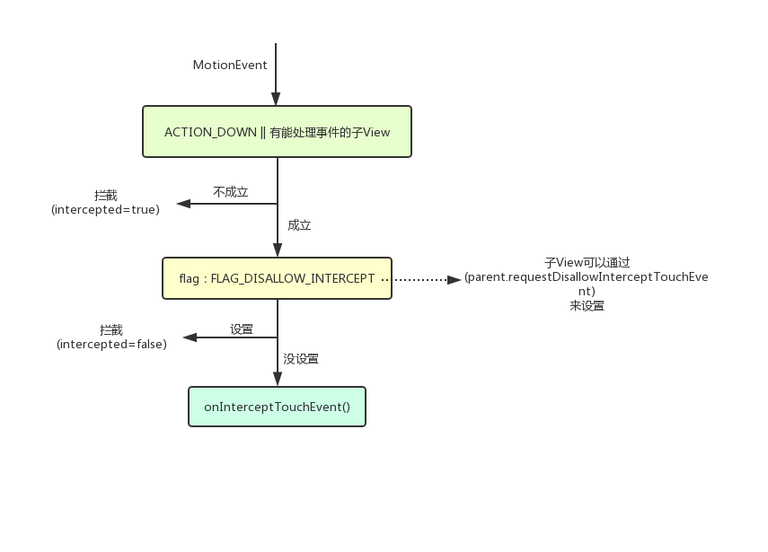
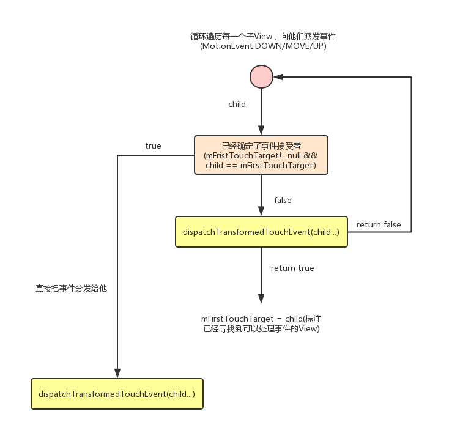
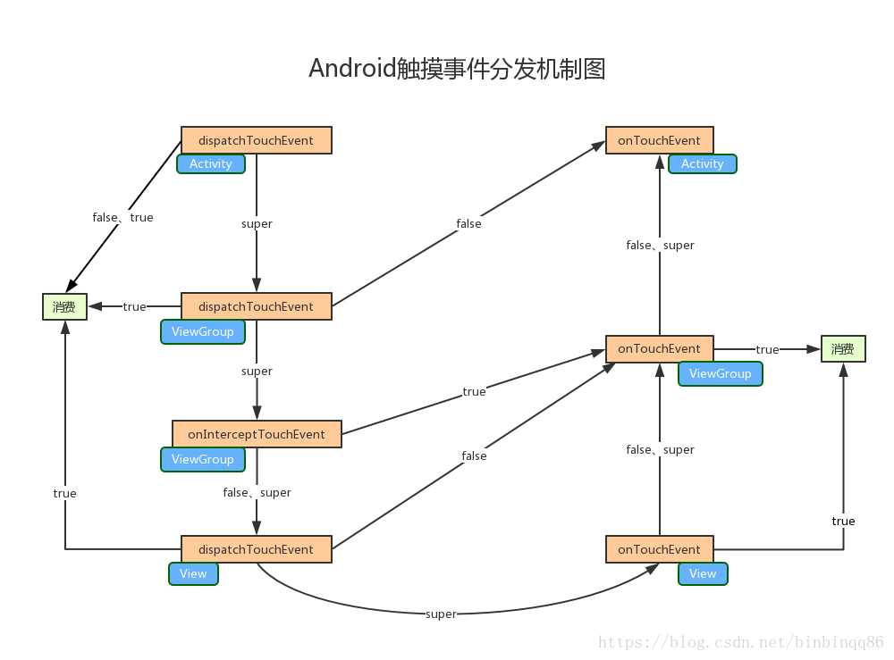

>上一篇文章我们看了[触摸事件的产生 -> Activity.dispatchTouchEvent()的整个过程](Android触摸事件全过程分析.md)。本文就从`Activity.dispatchTouchEvent()`为起点来看一下触摸事件是如何在`View`中进行分发的。触摸事件分发的源码还是比较简单的(代码量比较少)。

>Activity
```
public boolean dispatchTouchEvent(MotionEvent ev) {
    if (ev.getAction() == MotionEvent.ACTION_DOWN) {
        onUserInteraction(); //这个方法作为Activity开始与用户触摸事件交互的回调
    }
    if (getWindow().superDispatchTouchEvent(ev)) { //交由Window处理，返回true，则代表事件处理完成
        return true;
    }
    return onTouchEvent(ev); //Window不能处理这个事件则自己处理
}
```

即调用了`getWindow().superDispatchTouchEvent(ev)`,这里的`Window`实际上是`PhoneWindow`,这个方法最终会调用到`DecorView(FrameLayout).dispatchTouchEvent()`,这里就是`View`触摸事件分发的起点。

## 事件的分发过程 : ViewGroup(FrameLayout).dispatchTouchEvent()

这个方法其实并不是很长，但是也不好一次性看完。我们下面把这个方法分为3步来进行解析。

### Step1 : 是否拦截

>ViewGroup.dispatchTouchEvent()
```
    final boolean intercepted;
    if (actionMasked == MotionEvent.ACTION_DOWN || mFirstTouchTarget != null) { //在第一次派发事件(ACTION_DOWN)时,mFirstTouchTarget必定为null
        //在第一次事件(ACTION_DOWN)派发过程中子View可以请求父View不要对触摸事件做拦截。 
        //但是必须是父View在onInterceptTouchEvent中返回了false。否则子View是无法请求父View不要去拦截事件的。
        //因为它根本就没有机会
        final boolean disallowIntercept = (mGroupFlags & FLAG_DISALLOW_INTERCEPT) != 0;  //ViewGroup.requestDisallowInterceptTouchEvent()可以设置这个flag
        if (!disallowIntercept) {
            intercepted = onInterceptTouchEvent(ev);
            ev.setAction(action);  //restore action in case it was changed
        } else {
            intercepted = false;
        }
    } else {
        intercepted = true;
    }

    if(!intercepted){
        //派发事件到子View
    }else{
        //自己处理这个事件
    }
```

`mFirstTouchTarget`是指在一次事件派发过程中能处理事件的某个子View。解释一下上面这段代码:

1. 如果是`ACTION_DOWN`事件或者`事件已经有处理者(mFirstTouchTarget!=null)`，那么就要判断是否拦截这次触摸事件。即`确定intercepted的值`和`是否回调onInterceptTouchEvent()`。
2. 子View可以通过调用`parent.requestDisallowInterceptTouchEvent()`来禁止父View拦截事件的传递。但前提是父View没有对`ACTION_DOWN`事件做拦截， 即(actionMasked == MotionEvent.ACTION_DOWN || mFirstTouchTarget != null)成立

可以用下面这张图描述`是否拦截`的相关逻辑:




## Step2 : 分发事件到子View

如果第一步中`intercepted==false`,那么就会把这次触摸事件向`子View`进行分发。大致分发的逻辑是:**对子View按照Z轴的顺序来派发事件(显示在最上层的子View会先接收到事件)**

>ViewGroup.dispatchTouchEvent()
```
    //循环遍历子View，把事件派发给它们
    for (int i = childrenCount - 1; i >= 0; i--) { 

        final View child = ...

        view 是可见的才可以接收事件，如果不可见的话不会走下面的代码

        //如果是第一次派发事件(ACTION_DOWN)，这个方法返回null。 
        //如果进行了ACTION_DOWN事件的派发，那么mFirstTouchTarget!= null, 如果child == mFristTouchTarget,则直接把事件派发给他(child)
        newTouchTarget = getTouchTarget(child);  
        if (newTouchTarget != null) {
            ...
            break;
        }

        //这个方法会调用子View(View/ViewGroup)的dispatchTouchEvent，看这个child是否能处理事件
        if (dispatchTransformedTouchEvent(ev, false, child, idBitsToAssign)) {  
            //子View可以处理这次事件
            ...
            //这个newTouchTarget就是 mFirstTouchTarget
            newTouchTarget = addTouchTarget(child, idBitsToAssign); //把 以处理这个事件的子View添加到 TouchTarget 链表中。 并把它设置为mFirstTouchTarget
            alreadyDispatchedToNewTouchTarget = true;
            break;
        }
    }

    这段是我写的伪逻辑:
    // 对于ACTION_MOVE事件的派发，在ACTION_DWON派发中如果已经寻找到目标child，那么会直接走这个逻辑
    if(newTouchTarget !=null && !alreadyDispatchedToNewTouchTarget){ 
        dispatchTransformedTouchEvent(ev, cancelChild, target.child, target.pointerIdBits)
    }
```

`dispatchTransformedTouchEvent()`的逻辑其实也比较简单:

>ViewGroup.dispatchTransformedTouchEvent()
```
private boolean dispatchTransformedTouchEvent(MotionEvent event, boolean cancel,View child, int desiredPointerIdBits) {
    ...
    if (child == null) {
        handled = super.dispatchTouchEvent(event);   //如果本身是`ViewGroup`，那么这里实际上调用的是View.dispatchTouchEvent()
    } else {
        final float offsetX = mScrollX - child.mLeft;
        final float offsetY = mScrollY - child.mTop;

        //派发给子View前 对坐标进行了转换
        event.offsetLocation(offsetX, offsetY);

        handled = child.dispatchTouchEvent(event); //调用子View的 dispatchTouchEvent()

        //派发给子View后 再把坐标转换回来
        event.offsetLocation(-offsetX, -offsetY);
    }
    ...
}
```

其实我感觉用语言并不是很好描述，还是看图吧:



## Step3 : 没找到事件处理者，自己处理这次事件。View.dispatchTouchEvent()

这段逻辑对应的是下面这段代码:

>ViewGroup.dispatchTouchEvent()
```
    if (mFirstTouchTarget == null) { //没有谁能够处理这个事件,交由自己来处理   
        //传null， 会调用 super.dispatchTouchEvent(event)。
        handled = dispatchTransformedTouchEvent(ev, canceled, null, TouchTarget.ALL_POINTER_IDS);
    } 
```

这里`super.dispatchTouchEvent(event)`实际上是调用到了`View.dispatchTouchEvent()`:

>View.dispatchTouchEvent()
```
    public boolean dispatchTouchEvent(MotionEvent event) {
        ...

        ListenerInfo li = mListenerInfo;
        if (li != null && li.mOnTouchListener != null
                && (mViewFlags & ENABLED_MASK) == ENABLED
                && li.mOnTouchListener.onTouch(this, event)) {
            result = true;
        }

        if (!result && onTouchEvent(event)) {
            result = true;
        }

        ...

        return result;
    }
```

即会依次调用`View`的 : `i.mOnTouchListener.onTouch(this, event)`、`onTouchEvent(event)`

ok，到这里，分析完了`ViewGroup.dispatchTouchEvent()`的全逻辑。那触摸事件分发过程中，事件是如何消费和传递的呢？(上面代码中我没有展示事件消费相关代码),可以结合下面这张图，来理解触摸事件传递过程中是如何被消费的:



>图出自 : https://blog.csdn.net/binbinqq86/article/details/82315399


## 源码走查后的一些小结论

### 如果在一次事件派发中没有一个`子View`对事件做了处理，那么就不会再派发事件。全部事件由自己来处理。

其实就对应着上面`Step2`中，如果对子`View`遍历后`mFirstTouchTarget`还是为null，那么就自己来处理这个事件:

```
    if (actionMasked == MotionEvent.ACTION_DOWN || mFirstTouchTarget != null) { 

    }else{
        intercepted = true
    }

    if(intercepted){
        //自己处理
    }
```

### 如果`子View`处理了触摸事件，那么后续的事件都会派发到这个`子View`，不会派发给`其他子View`处理了

即`Step2`中，在变量`子View`时，如果发现`子View`就是`mFirstTouchTarget`，那么就会跳出循环，直接把事件派发给这个`子View`

```
 for (int i = childrenCount - 1; i >= 0; i--) { 
 
 }
```

- 

比如: 子View(onTouchEvent)返回True:

>父View(dispatchTouchEvent) -> 父View(onInterceptTouchEvent)->子View(dispatchTouchEvent)->子View(onTouchEvent)

比如: 子View(dispatchTouchEvent)返回True:

>父View(dispatchTouchEvent) -> 父View(onInterceptTouchEvent)->子View(dispatchTouchEvent)

- 如果父View拦截了触摸事件，并且`onTouchEvent`返回True，那么事件的派发路径是:

>父View(dispatchTouchEvent)->父View(onTouchEvent)

- 如果父View(dispatchTouchEvent)返回了true

>那么这个事件只能分发到父View(`dispatchTouchEvent`)


#ViewGroup


## dispatchTouchEvent

如果直接返回true，那相当于没有做触摸事件的分发，所有的事件都由父View拦截


## onInterceptTouchEvent

如果这个方法返回了false, 并且父View没有处理触摸事件，那么每次都会回调这个方法，并且将事件分发到子View中。

如果父View在`ACTION_DOWN`事件的下发过程中，`onInterceptTouchEvent`就返回了true，那么事件是永远不可能派发到子View的。

如果子View接收到了`ACTION_DOWN`事件，那么它是可以通过`parent.requestDisallowInterceptTouchEvent()`来使父View不拦截事件的下发的。