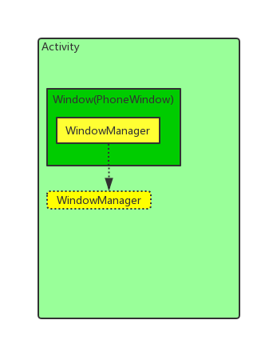
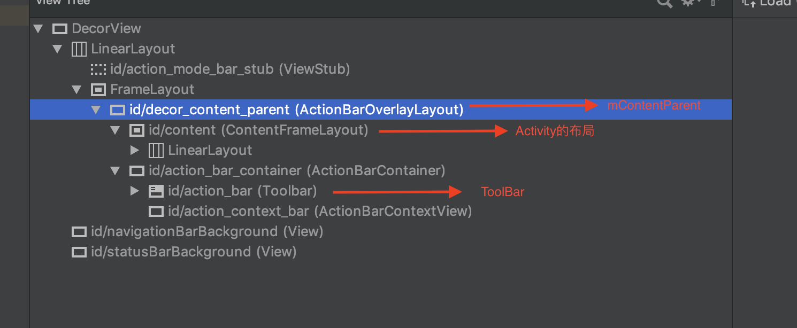
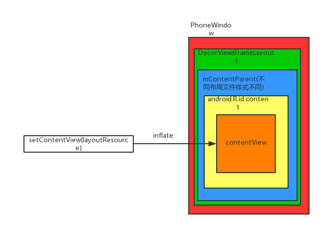
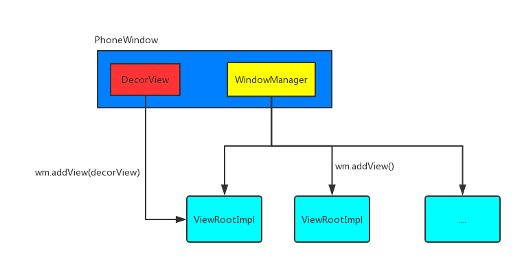

本文是[Android视图层源码分析](https://github.com/SusionSuc/AdvancedAndroid/blob/master/AndroidFramework%E6%BA%90%E7%A0%81%E5%88%86%E6%9E%90/Android%E8%A7%86%E5%9B%BE%E5%B1%82%E6%BA%90%E7%A0%81%E5%88%86%E6%9E%90/README.md)系列第一篇文章。主要来理清`Window`的地位以及作用。

>Android中所有的视图(`View`)都是通过`Window`来呈现的，不管是`Activity`、`Dialog`还是`Toast`,它们的视图实际上都是附加在`Window`上的，因此`Window`实际是`View`的直接管理者。本文就从源码来分析一下`Window`，理清`Window`是如何组织视图(`View`)以及`Activity`的`PhoneWindow`的工作原理。本文不会去讨论`Window`的详细使用。

分析之前，我们先找一个切入点,以下面这段代码为例:

>WindowTestActivity.java
```
// example 1
val simpleTv = getSimpleTextView()
windowManager.addView(simpleTv, getSimpleWindowLayoutParams()) 

//example 2
window.addContentView(getSimpleTextView(), ViewGroup.LayoutParams(ViewGroup.LayoutParams.WRAP_CONTENT, ViewGroup.LayoutParams.WRAP_CONTENT))
```

即我们直接通过`windowManager.addView`和`window.addContentView()`来添加了一个`View`。这两个方法都是`Activity`直接提供的方法,也是我们唯一与`Window`交互的几个方法之一，那:

1. 这两个方法有什么关系与不同呢？
2. `View`究竟添加到了哪里呢？
3. `window`和`windowManager`有什么关系呢？

下面我们将从源码一点一点弄清这些问题。先来看一下`windowManager.addView(contentView, layoutParams)`,为了下面方便叙述，我们把被`add`的`view`叫做`contentView`。

# 通过`WindowManager`添加一个View

## `WindowManager`实例的创建

`WindowManager`是一个接口,在看`windowManager.addView()`之前我们先来看一下`Activity的WindowManager`的实例是谁。

追踪`Activity`的源码发现`WindowManager`其实是通过`Window`来获取的(它其实是`Window`的成员变量)

```
mWindowManager = mWindow.getWindowManager();
```

那`Window`的`WindowManager`是在什么地方赋值的呢？其实是在`Activity attch`时:

```
//Activity.java
final void attach(...){
    mWindow = new PhoneWindow(this, window, activityConfigCallback);
    ...
    mWindow.setWindowManager((WindowManager)context.getSystemService(Context.WINDOW_SERVICE), mToken,..);
}
```

`mWindow.setWindowManager()`内部其实是构造了一个`WindowManagerImpl`:

```
public void setWindowManager(WindowManager wm, IBinder appToken...) {
    ...
    mWindowManager = ((WindowManagerImpl)wm).createLocalWindowManager(this);
}
```

即 **`Activity`的`PhoneWindow`的`WindowManager`实例是`WindowManagerImpl`**

并且在`Activity.attach`方法中也可以看出`Activity`的`Window`的实例时`PhoneWindow`(`PhoneWindow`其实是`Window`的唯一实现类，是针对于`app客户端(相对于Android系统)`的一个`Window`实体)。

`WindowManagerImpl`其实只是一个简单的装饰类，所有操作直接转发到了`WindowManagerGlobal`, 因此`windowManager.addView()`源码的追踪可以直接看`WindowManagerGlobal.addView()`:

```
public void addView(View view, ViewGroup.LayoutParams params, Display display, Window parentWindow) {
    ...
    ViewRootImpl root;
    View panelParentView = null;
    ...

    root = new ViewRootImpl(view.getContext(), display);
    view.setLayoutParams(wparams);
    
    mViews.add(view);
    mRoots.add(root);
    mParams.add(wparams);

    root.setView(view, wparams, panelParentView);
}
```

`parentWindow`这个参数其实就是`Activity`的`window(PhoneWindow)`。而`WindowManagerGlobal.addView()`做的主要事情是:

1. 构造了一个`(root)ViewRootImpl`
2. 分别把`contentView`相关对象放入到`mViews/mRoots/mParams`集合中。(如果`contentView`被移除,那么这3个集合相关对象也会被移除)
3. `root.setView(contentView..)`会通过IPC调用到`WindowManagerService`来在`window`中显示`contentView`。

所以`windowManager.addView()`做的事情是:

**为`contentView`创建一个`ViewRootImpl`对象，并把`contentView`相关对象放入到`mViews/mRoots/mParams`集合中维护起来，然后调用`ViewRootImpl.setView(..)`方法来显示`contentView`**

所以到这里可以用下面这张图总结一下`Activity/Window/WindowManager`之间的关系:



经过上面的分析我们还知道 : 通过`windowManager.addView(contentView)`来显示视图其实是和`Activity`的`Window`有着密切的联系的(显示一个视图必须要有`Window`)。那`Activity`的视图是怎么显示的呢？

我们继续看一下(其实`Activity`的视图也是通过`windowManager.addView(contentView)`的方式来显示的):

# `Activity`的视图的显示

追踪`Activity.setContentView(..)`源码可以看到:

```
getWindow().setContentView(contentView);
```

即我们的`contentView`其实是设置给了`Window(PhoneWindow)`:

## `PhoneWindow`的视图层级

>PhoneWindow.java
```
public void setContentView(View view, ViewGroup.LayoutParams params) {
    if (mContentParent == null) {
        installDecor();
    } else if (!hasFeature(FEATURE_CONTENT_TRANSITIONS)) {
        mContentParent.removeAllViews();
    }
    ...
    mContentParent.addView(view, params);
}
```

即我们`Activity`的根布局View其实是添加到了`PhoneWindow的mContentParent成员变量中`中。那`mContentParent`是什么呢？看一下`PhoneWindow.installDecor()`,这个方法也很长，因此只截取最重要的部分看一下:

```
private void installDecor() {
    mDecor = generateDecor(-1);  // decor 的实例时DecorView,它继承自FrameLayout
    ...
    mDecor.setWindow(this);  //DecorView 绑定一个window
    ...
    mContentParent = generateLayout(mDecor); // mContentParent 会被add到 decor view中
    ...  
}
```

根据上面的注释,我们可以先这样理解`PhoneWindow/DecorView/mContentParent`的关系:

**`PhoneWindow`里存在一个`DecorView(mDecor)`成员变量,可以把它理解为一个`FrameLayout`,它包含一个`mContentParent`的子View, `mContentParent`是`Activity`的根布局`contentView`的父View**

那`mContentParent`是一个什么样的`布局/View`呢？继续看一下`generateLayout(mDecor)`:

```
protected ViewGroup generateLayout(DecorView decor) {

     int layoutResource; //mContentParent的布局文件

    int features = getLocalFeatures();

    if ((features & (1 << FEATURE_SWIPE_TO_DISMISS)) != 0) {
        ....各种 if else
    } else {
        // Embedded, so no decoration is needed.
        layoutResource = R.layout.screen_simple;
    }

    mDecor.onResourcesLoaded(mLayoutInflater, layoutResource); //会把这个布局文件inflate出的view，添加到DecorView中

    //通过 findViewById 来获取 ContentParent。 这个id其实就来自 layoutResource 所指向的布局文件
    ViewGroup contentParent = (ViewGroup)findViewById(ID_ANDROID_CONTENT);

}
```

上面我做了一些注释，可以理解为`mContentParent`就是`DecorView`的子View。`layoutResource`根据当前`Activity`的`Theme`的设置，会对应到许多不同的布局文件，`R.layout.screen_toolbar`是给`Activity`设置默认
`Theme`是所对应的布局文件:

```
<com.android.internal.widget.ActionBarOverlayLayout
    android:id="@+id/decor_content_parent"
    ...>
    <FrameLayout android:id="@android:id/content"
                 android:layout_width="match_parent"
                 android:layout_height="match_parent" />
    <com.android.internal.widget.ActionBarContainer
        android:id="@+id/action_bar_container"
        ...
        android:gravity="top">
        <Toolbar
            android:id="@+id/action_bar"
            ... />
        <com.android.internal.widget.ActionBarContextView
            android:id="@+id/action_context_bar"
            ..../>
    </com.android.internal.widget.ActionBarContainer>
</com.android.internal.widget.ActionBarOverlayLayout>
```

看一个具体的`Android Layout Inspectot`分析:



`ContentFrameLayout`是`support v7`的类，可以把它理解为`FrameLayout`。

`PhoneWindow`的视图层级可以用下图表示



经过上面的分析: **`PhoneWindow`的视图层级其实就是`DecorView`的视图层级。`DecorView`就是`Activity`视图的根`View`。**

所以`Activity`的视图显示的过程其实就是`DecorView`的视图显示的过程。那`DecorView`如何显示呢？

它的显示原理也是使用`windowManager.addView()` :

## DecorView的显示

在`Activity Resume`时，`DecorView`会添加到`WindowManager`中:

>ActivityThread.java
```
public void handleResumeActivity(IBinder token, boolean finalStateRequest, boolean isForward,String reason) {
    final ActivityClientRecord r = performResumeActivity(token, finalStateRequest, reason);
    ...
    final Activity a = r.activity;
    ...
    wm.addView(decor, l);
}
```

即在`Activity Resume`时`DecorView`添加到`WindowManager`中，进而通过`WindowManagerService`来显示成功。所以`Activity.onResume()`用户才可以看到`Activity`的视图。

# 总结

总结一下到目前为止所分析的点:

1. 视图(View)的显示离不开`Window`。
2. `WindowManager`属于`Window`，负责管理`Window`中`View`的显示。在`Window`中显示`View`我们应使用它的接口
3. 一个`Window`可以有多个子View，每个子`View`都对应一个`ViewRootImpl`。
4. `ViewRootImpl`会通过IPC来与`WindowManagerService`交互，来实现`View`的显示

它们之间的关系如下图:



下一篇文章将继续分析`ViewRootImpl.setView(..)`所引起的`WindowManagerService`的操作，即`Window`是怎么在屏幕上展示内容的。

**欢迎关注我的[Android进阶计划](https://github.com/SusionSuc/AdvancedAndroid)看更多干货**

**欢迎关注我的微信公众号:susion随心**


>参考文章:

- 《Android开发艺术探索》


