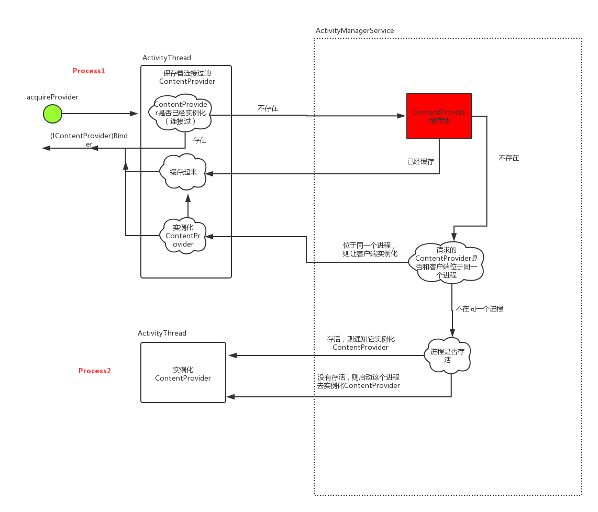
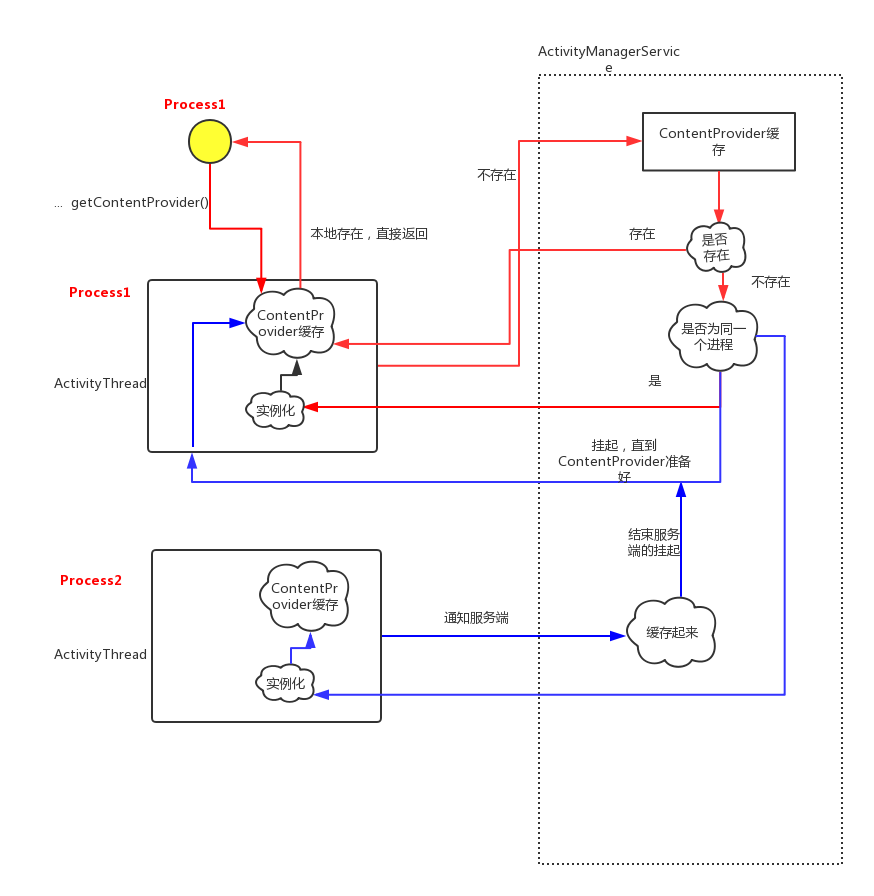

>前面阅读了[BroadcastReceiver的源码](https://github.com/SusionSuc/AdvancedAndroid/blob/master/%E6%8F%92%E4%BB%B6%E5%8C%96/VirtualApk/%E4%BB%8E%E6%BA%90%E7%A0%81%E4%BA%86%E8%A7%A3BroadcastReceiver%E7%9A%84%E5%B7%A5%E4%BD%9C%E8%BF%87%E7%A8%8B.md)。
>这篇文章也应该是继续看`VirtualApk`中关于`插件ContentProvider`的处理的。不过由于处理逻辑比较简单,所以到最后再看。本文的目的是了解系统对于`ContentProvider`的整个处理的过程。

`ContentProvider`是一个可以跨进程的组件,比如我们可以使用通讯录的`ContentProvider`来获取手机中的通信录信息。`ContentResolver`封装了`ContentProvider`跨进程通信的逻辑，使我们在使用`ContentProvider`时不需要关心这些细节。

那我们在使用`context.getContentResolver().query(uri)`时发生了什么呢？我们的进程是如何使用其他进程的ContentProvider的呢？
接下来我们就来分析Android系统源码对于`ContentProvider`的处理，来弄明白这些问题。

# ContentProvider的实例化过程

我们从`ContextImp.getContentResolver().query()`开始看:

```
public final Cursor query(...) {
    IContentProvider unstableProvider = acquireUnstableProvider(uri); 
}
```

即首先要获得一个`IContentProvider`。它是ContentProvider可以跨进交互的一个`aidl`接口。其实这里拿到的就是一个`Binder`。所以接下来就看这个`IContentProvider(Binder)`是如果获取的。

我们在调用`ContextImp.getContentResolver()`获得的其实是`ApplicationContentResolver`。因此来看一下它的`acquireUnstableProvider()`:

```
protected IContentProvider acquireProvider(Context context, String auth) {
    return mMainThread.acquireProvider(context,
                ContentProvider.getAuthorityWithoutUserId(auth),
                resolveUserIdFromAuthority(auth), true);
    }
```

继续看源码, 切换到主线程`ActivityThread.java`:

```
public final IContentProvider acquireProvider(Context c, String auth, int userId, boolean stable) {
    // 如果已经缓存过这个 auth对应的IContentProvider，则直接返回
    final IContentProvider provider = acquireExistingProvider(c, auth, userId, stable);
    if (provider != null) return provider;

    ContentProviderHolder holder = null;
    
    holder = ActivityManager.getService().getContentProvider(
                    getApplicationThread(), auth, userId, stable);

    //获取失败
    if (holder == null) return null;

    //在向服务端获取holder，服务端如果发现ContentProvider的进程和当前客户端进程是同一个进程就会让客户端进程来实例化ContentProvider，具体细节可以在下面分析中看到
    holder = installProvider(c, holder, holder.info, true /*noisy*/, holder.noReleaseNeeded, stable);

    return holder.provider;
}
```

即在本地没有获得过`IContentProvider`时，直接向`ActivityManagerService`发起`getContentProvider`的请求,最终调用`ActivityManagerService.getContentProviderImpl()`, 这个方法就是`ContentProvider`实例化逻辑的核心了:

首先来看一下这个方法的声明:

`ContentProviderHolder getContentProviderImpl(IApplicationThread caller,String name, IBinder token, boolean stable, int userId)`

即最终是返回一个`ContentProviderHolder`,它是什么呢？它其实是一个可以在进程间传递的数据对象(aidl)，看一下它的定义:

```
public class ContentProviderHolder implements Parcelable {
    public final ProviderInfo info;
    public IContentProvider provider;
    public IBinder connection;
    ...
```

继续看`getContentProviderImpl()`,这个方法比较长，所以接下来我们分段来看这个方法, 顺序是(1)、(2)、(3)... 这种 : 

>`ActivityManagerService.getContentProviderImpl()(1)`
```
    //三个关键对象
    ContentProviderRecord cpr;
    ContentProviderConnection conn = null;
    ProviderInfo cpi = null;
    ...
    cpr = mProviderMap.getProviderByName(name, userId); // 看看系统是否已经缓存了这个ContentProvider
```

先来解释一下`ContentProviderRecord`、`ContentProviderConnection`、`ProviderInfo`、`mProviderMap`它们大概是什么:

`ContentProviderRecord`: 它是系统(ActivityManagerService)用来记录一个`ContentProvider`相关信息的对象。

`ContentProviderConnection`: 它是一个`Binder`。连接服务端(ActivityManagerService)和客户端(我们的app)。里面记录着一个`ContentProvider`的状态，比如是否已经死掉了等。

`ProviderInfo`: 用来保存一个`ContentProvider`的信息(manifest中的`<provider>`), 比如`authority`、`readPermission`等。

`mProviderMap`: 它的类型是`ProviderMap`。它里面存在几个map，这些map都是保存`ContentProvider`的信息的。

ok我们继续来看源码:

>`ActivityManagerService.getContentProviderImpl()(2)`
```
    cpr = mProviderMap.getProviderByName(name, userId); // 看看系统是否已经缓存了这个ContentProvider
    boolean providerRunning = cpr != null && cpr.proc != null && !cpr.proc.killed;
    if (providerRunning) { 
        ...
    }

    if (!providerRunning) {
        ...
    }
```

即根据`ContentProvider`所在的`进程是否是活跃`、`这个ContentProvider是否被启动过(缓存下来)`两个状态来进行不同的处理 :

## ContentProvider已被加载并且所在的进程正在运行
即: `if(providerRunning){ ... }`中的代码
>`ActivityManagerService.getContentProviderImpl()(3)`
```
    ProcessRecord r = getRecordForAppLocked(caller); //获取客户端(获得content provider的发起者)的进程信息
    if (r != null && cpr.canRunHere(r)) { //如果请求的ContentProvider和客户端位于同一个进程
        ContentProviderHolder holder = cpr.newHolder(null); //ContentProviderConnection参数传null
        holder.provider = null; //注意，这里置空是让客户端自己去实例化！！
        return holder;
    }

    //客户端进程正在运行，但是和ContentProvider并不在同一个进程
    conn = incProviderCountLocked(r, cpr, token, stable); // 直接根据 ContentProviderRecord和ProcessRecord 构造一个 ContentProviderConnection

    ...
```

即如果请求的是同进程的`ContentProvider`则直接回到进程的主线程去实例化`ContentProvider`。否则使用`ContentProviderRecord`和`ProcessRecord`构造一个`ContentProviderConnection`

## ContentProvider所在的进程没有运行并且服务端(ActivityManagerService)没有加载过它
即: `if(!providerRunning){ ... }`中的代码
>`ActivityManagerService.getContentProviderImpl()(4)`
```
    //先解析出来一个ProviderInfo
    cpi = AppGlobals.getPackageManager().resolveContentProvider(name, STOCK_PM_FLAGS | PackageManager.GET_URI_PERMISSION_PATTERNS, userId);
    ...
    ComponentName comp = new ComponentName(cpi.packageName, cpi.name);
    cpr = mProviderMap.getProviderByClass(comp, userId); //这个content provider 没有被加载过

    final boolean firstClass = cpr == null;
    if (firstClass) {
        ...
        cpr = new ContentProviderRecord(this, cpi, ai, comp, singleton); // 构造一个 ContentProviderRecord
    }

    ...

    final int N = mLaunchingProviders.size(); //  mLaunchingProviders它是用来缓存正在启动的 ContentProvider的集合的
    int i;
    for (i = 0; i < N; i++) {
        if (mLaunchingProviders.get(i) == cpr) {  // 已经请求过一次了，provider正在启动，不重复走下面的逻辑
            break;
        }
    }

    //这个 ContentProvider 不是在启动状态，也就是还没启动
    if (i >= N) {
        ProcessRecord proc = getProcessRecordLocked(cpi.processName, cpr.appInfo.uid, false);
        ...
        
         if (proc != null && proc.thread != null && !proc.killed) { //content provider所在的进程已经启动
            proc.thread.scheduleInstallProvider(cpi); //安装这个 Provider , 即客户端实例化它
          } else {
            //启动content provider 所在的进程, 并且唤起 content provider
            proc = startProcessLocked(cpi.processName,cpr.appInfo, false, 0, "content provider",new ComponentName(cpi.applicationInfo.packageName,cpi.name)...);
         }

        cpr.launchingApp = proc;
        mLaunchingProviders.add(cpr); //添加到正在启动的队列
    }

    //缓存 ContentProvider信息
    if (firstClass) {
        mProviderMap.putProviderByClass(comp, cpr);
    }
    mProviderMap.putProviderByName(name, cpr);

    //构造一个 ContentProviderConnection
    conn = incProviderCountLocked(r, cpr, token, stable);
    if (conn != null) {
        conn.waiting = true; //设置这个connection
    }
```

## 等待客户端实例化 ContentProvider

>`ActivityManagerService.getContentProviderImpl()`(5)
```
    // Wait for the provider to be published...
    synchronized (cpr) {
        while (cpr.provider == null) {
            ....
            if (conn != null) {
                conn.waiting = true;
            }
            cpr.wait();
        }
    }

    return cpr != null ? cpr.newHolder(conn) : null; //返回给请求这个客户端的进程
```

根据前面的分析，ContentProvider所在的进程没有运行或者不是和`获取者`同一个进程，就创建了一个`ContentProviderConnection`,那么服务端就会挂起，启动ContentProvider所在的进程，并等待它实例化`ContentProvider` :

在继续看客户端实例化ContentProvider之前，我们先用一张图来总结一下客户端进程请求服务端(`ActivityManagerService`)启动一个ContentProvider的逻辑 :




# 客户端实例化ContentProvider

ok，通过前面的分析我们知道`ContentProvider`最终是在它所在的进程实例化的。接下来就看一下客户端相关代码, 


### 同一个进程中的ContentProvider实例化过程

前面分析我们知道，如果`客户端进程`和`请求的ContentProvider`位于同一个进程，则` ActivityManager.getService().getContentProvider(...);`,会返回一个内容为空的`ContentProviderHolder`,
我们再拿刚开始客户端向服务端请求ContentProvider的代码看一下:

```
    holder = ActivityManager.getService().getContentProvider( getApplicationThread(), auth, userId, stable);

    //在向服务端获取holder，服务端如果发现ContentProvider的进程和当前客户端进程是同一个进程就会让客户端进程来实例化ContentProvider，具体细节可以在下面分析中看到
    holder = installProvider(c, holder, holder.info, true /*noisy*/, holder.noReleaseNeeded, stable);
```
我们继续看`ActivityThread.installProvider`, 这个方法其实有两个逻辑, 下面我只截取一些关键的逻辑,我们现在只看`同一个进程中的ContentProvider实例化过程`, 即会初始化`localProvider`的逻辑:

```
private ContentProviderHolder installProvider(...) {
    ContentProvider localProvider = null;
    IContentProvider provider;

    if (holder == null || holder.provider == null) { //服务端没有缓存过这个provider，客户端需要初始化
        final java.lang.ClassLoader cl = c.getClassLoader();
        LoadedApk packageInfo = peekPackageInfo(ai.packageName, true);

        localProvider = packageInfo.getAppFactory().instantiateProvider(cl, info.name);//实例化ContentProvider
        provider = localProvider.getIContentProvider(); 
        ...
        localProvider.attachInfo(c, info);
    }else {
        provider = holder.provider;
    }

    ContentProviderHolder retHolder;
    IBinder jBinder = provider.asBinder();

    if (localProvider != null) { //同一个进程的ContentProvider
         ProviderClientRecord pr = mLocalProvidersByName.get(cname);
         pr = installProviderAuthoritiesLocked(provider, localProvider, holder); //把Provider缓存起来
        retHolder = pr.mHolder;
    }else{
        ProviderRefCount prc = mProviderRefCountMap.get(jBinder); //其他进程的ContentProvider
        ...
        if(prc == null){
            prc = new ProviderRefCount(holder, client, 1000, 1000);
            //也缓存起来
            ProviderClientRecord client = installProviderAuthoritiesLocked(provider, localProvider, holder);
            mProviderRefCountMap.put(jBinder, prc);
            ...
        }
        retHolder = prc.holder;
    }
    return retHolder;
}
```

对于这个方法我们暂且知道在`客户端进程`和`请求的ContentProvider`位于同一个进程时它会: *实例化ContentProvider,缓存起来*


### 不在同一个进程中的ContentProvider实例化过程

如果`客户端进程`和`请求的ContentProvider`不在同一个进程，根据前面我们分析`ActivityManagerService`的逻辑可以知道, `ActivityManagerService`会调用`ContentProvider`所在进程的`proc.thread.scheduleInstallProvider(cpi)`,
其实最终调用到`installContentProviders()`

```
 private void installContentProviders(Context context, List<ProviderInfo> providers) {
        final ArrayList<ContentProviderHolder> results = new ArrayList<>();

        //ActivityManagerService 让客户端启动的是一个ContentProvider列表
        for (ProviderInfo cpi : providers) {
            ContentProviderHolder cph = installProvider(context, null, cpi,false, true ,true);
            if (cph != null) {
                cph.noReleaseNeeded = true;
                results.add(cph);
            }
        }

        ActivityManager.getService().publishContentProviders(getApplicationThread(), results); //通知服务端，content provider ok啦
    }
```

即它会调用`installProvider`来实例化`ContentProvider`，并通知服务端`ContentProvider`ok了，可以给其他进程使用了。

那`installProvider`具体做了什么呢？ 前面已经分析过了，其实就是 *缓存下其他进程的`IContentProvider(Binder)`*。你可以去看一下上面
`installProvider`方法的`localProvider == null`的那个逻辑。


到这里，客户端其实就拿到了`IContentProvider(Binder)`。 即`ContextImp.getContentResolver().query()`拿到了`IContentProvider`。可执行`query`了。

是不是有点云里雾里的，我们看一下下面这张图，来理一下思路吧:



到这里我们算理解了`ContentProvider`的工作原理, 我们以一个`ContentProvider`第一次启动为例来总结一下:

1. 进程在启动ContentProvider时会向`ActivityManagerService`要，`ActivityManagerService`如果没有就会让客户端启动这个`ContentProvider`
2. 客户端进程启动`ContentProvider`后就会缓存起来, 方便后续获取
3. `ActivityManagerService`只会缓存那些可能跨进程访问的`ContentProvider`
4. 和不同进程的`ContentProvider`通信是通过`Binder`实现的


# VirtualApk关于ContentProvider的处理

`VirtualApk`它是一个插件化框架，它所需要支持的特性是: `插件中的ContentProvider`如何跑起来？ 它又没有在manifest中注册。

其实很简单，类似于它对`插件Service的支持`:

1. 定义一个占坑的ContentProvider（运行在一个独立的进程）
2. hook掉`插件Activity的Context`,并返回自定义的`PluginContentResolver`
3. `PluginContentResolver`在获取`ContentProvider`时，先把`个占坑的ContentProvider`唤醒。即让它在`ActivityManagerService`中跑起来
4. 返回给插件一个`IContentProvider`的动态代理。
5. 插件通过这个`IContentProvider动态代理`来对`ContentProvider`做增删改查
6. 在动态代理中把插件的增删改查的Uri,重新拼接定位到`占坑的ContentProvider`
7. 在`占坑的ContentProvider`实例化插件请求的`ContentProvider`，并做对应的增删该查。

所以:

1. `插件的ContentProvider`是运行在`占坑的ContentProvider`进程中的。
2. `插件的ContentProvider`是不会运行在自己自定的进程中的，即没有多进程`ContentProvider`的概念。

>欢迎Star我的[Android进阶计划](https://github.com/SusionSuc/AdvancedAndroid),看更多干货


