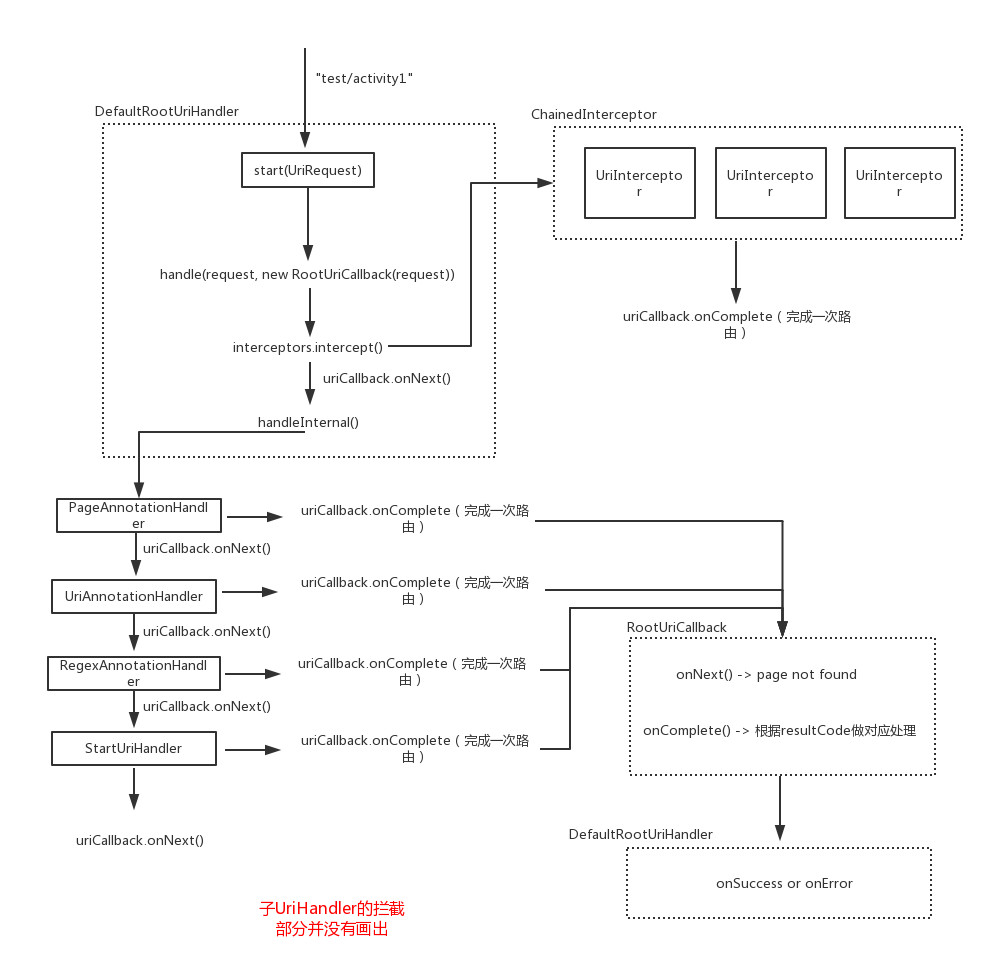

>文章来源自作者的Android进阶计划(https://github.com/SusionSuc/AdvancedAndroid)

本文整理一下`WMRouter`的基本路由逻辑，并剖析相关路由类的设计。作者巧妙的使用继承设计了整个`WMRouter`的路由体系，下面我们就从源码来看一下是如何实现的:

## UriHandler

在`WMRouter`中，对于每一个或每一类`Uri`都会有一个`UriHandler`来做处理，这个类定义了一个基本的处理逻辑。

```
public abstract class UriHandler {
    //拦截器列表
    protected ChainedInterceptor mInterceptor;

    //添加拦截器
    public UriHandler addInterceptor(@NonNull UriInterceptor interceptor) {
        ....
    }

    //Uri处理的基本流程
    public void handle(@NonNull final UriRequest request, @NonNull final UriCallback callback) {
        ...
    }

    // 是否要处理给定的URI
    protected abstract boolean shouldHandle(@NonNull UriRequest request);

    //子UriHandler需要写的处理逻辑
    protected abstract void handleInternal(@NonNull UriRequest request, @NonNull UriCallback callback);
}

```

`UriHandler`在对一个`Uri`处理时，会调用`handle`方法，因此我们可以通过这个方法理清一个Uri被路由的基本处理过程

```
    //处理URI。通常不需要覆写本方法。
    public void handle(@NonNull final UriRequest request, @NonNull final UriCallback callback) {
        if (shouldHandle(request)) {
            if (mInterceptor != null && !request.isSkipInterceptors()) {
                mInterceptor.intercept(request, new UriCallback() { 
                    @Override public void onNext() {
                        handleInternal(request, callback);
                    }
                    @Override public void onComplete(int result) {
                        callback.onComplete(result);
                    }
                });
            } else {
                handleInternal(request, callback);
            }
        } else {
            callback.onNext();
        }
    }
```

`mInterceptor`为 `ChainedInterceptor`的实例，下面会介绍。 `handle()`具体处理逻辑如下图:

.png)


## UriInterceptor 与 ChainedInterceptor

`UriInterceptor`为设置给`UriHandler`的拦截器,在`handleInternal`方法之前调用。

```
    public interface UriInterceptor {
        void intercept(@NonNull UriRequest request, @NonNull UriCallback callback);
    }
```

`UriHandler`中的拦截器是`ChainedInterceptor`, `ChainedInterceptor`实现了`UriInterceptor`, 并含有一个`UriInterceptor`列表，即支持添加多个拦截器，来看一下核心实现:

```
    public void intercept(@NonNull UriRequest request, @NonNull UriCallback callback) {
        next(mInterceptors.iterator(), request, callback);  //对于链上的每一个 interceptor 都要调用一遍
    }

    private void next(@NonNull final Iterator<UriInterceptor> iterator, @NonNull final UriRequest request, @NonNull final UriCallback callback) {
        if (iterator.hasNext()) {
            iterator.next().intercept(request, new UriCallback() {
                @Override public void onNext() {
                    next(iterator, request, callback);
                }
                @Override public void onComplete(int resultCode) {
                    callback.onComplete(resultCode);
                }
            });
        } else {
            callback.onNext();
        }
    }
```
即，依次遍历每一个`UriInterceptor`,调用其`intercept`方法。需要注意的是`callback.onComplete(resultCode)`的调用，会导致路由的终止。

## ChainedHandler

上面`UriHandler`是处理一个uri的hanler，比如 A Activity的路由为`test://a`,那么可以新建一个`UriHandler`来处理，而`ChainedHandler`则以列表组织多个`UriHandler`,每向`ChainedHandler`插入一个`UriHandler`可以指定一个一个优先级，优先级高的会被插入到列表前面。`ChainedHandler`复写了`handleInternal`方法:

```
    @Override
    protected void handleInternal(@NonNull final UriRequest request, @NonNull final UriCallback callback) {
        next(mHandlers.iterator(), request, callback);
    }

    private void next(@NonNull final Iterator<UriHandler> iterator, @NonNull final UriRequest request,
                      @NonNull final UriCallback callback) {
        if (iterator.hasNext()) {
            UriHandler t = iterator.next();
            t.handle(request, new UriCallback() {
                @Override
                public void onNext() {
                    next(iterator, request, callback);
                }
                @Override
                public void onComplete(int resultCode) {
                    callback.onComplete(resultCode);
                }
            });
        } else {
            callback.onNext();
        }
    }
```

即`ChainedHandler`会逐一调用每个`UriHandler`的`handle`方法。 

上面我们了解了`WMRouter`中路由的基本组成元素`UriHandler`、`UriInterceptor`、`ChainedHandler`、`ChainedInterceptor`, 接下来我们看下源码是如何使用它们构造路由体系的:

## RootUriHandler

它继承自`ChainedHandler`,提供`startUri(UriRequest)`并传入`RootUriCallback`来作为一次路由的起点:

    public void startUri(@NonNull UriRequest request) {
        //删除了一系列的判断条件
        handle(request, new RootUriCallback(request));
    }

    protected class RootUriCallback implements UriCallback {
        private final UriRequest mRequest;
        public RootUriCallback(UriRequest request) {
            mRequest = request;
        }

        @Override public void onNext() {
            onComplete(CODE_NOT_FOUND);
        }
        
        @Override public void onComplete(int resultCode) {
            switch (resultCode) {
                case CODE_REDIRECT:  // 重定向，重新跳转
                    startUri(mRequest);
                    break;
                case CODE_SUCCESS:
                    mRequest.putField(UriRequest.FIELD_RESULT_CODE, resultCode);
                    onSuccess(mRequest);
                    break;
                default:
                    mRequest.putField(UriRequest.FIELD_RESULT_CODE, resultCode);
                    onError(mRequest, resultCode);
                    break;
            }
        }
    }

基于上面的设计，在`WMRouter`中路由的起点`UriHandler`为`DefaultRootUriHandler`,这个`UriHandler`在起始时添加了下面4个子Handler:

```
    public DefaultRootUriHandler(Context context,@Nullable String defaultScheme, @Nullable String defaultHost) {
        // 处理RouterPage注解定义的内部页面跳转
        addChildHandler(createPageAnnotationHandler(), 300);
        // 处理RouterUri注解定义的URI跳转，如果注解没定义，继续分发到后面的Handler
        addChildHandler(createUriAnnotationHandler(defaultScheme, defaultHost), 200);
        // 处理RouterRegex注解定义的正则匹配
        addChildHandler( createRegexAnnotationHandler(), 100);
        addChildHandler(new StartUriHandler(), -100);
    }
```

这几个子`UriHandler`当然也是继承自`UriHandler`, 这里每一个子`UriHandler`都是一个`ChainedHandler`,即都会含有很多`UriHandler`。

经过上面的分析，我们大致可以总结`WMRouter`的路由过程:




